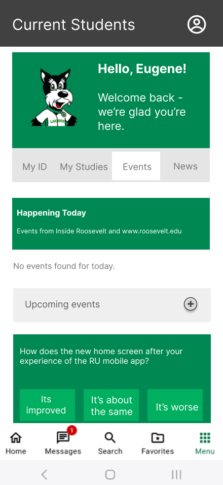
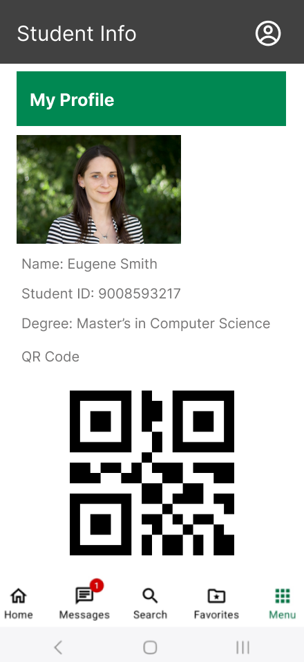
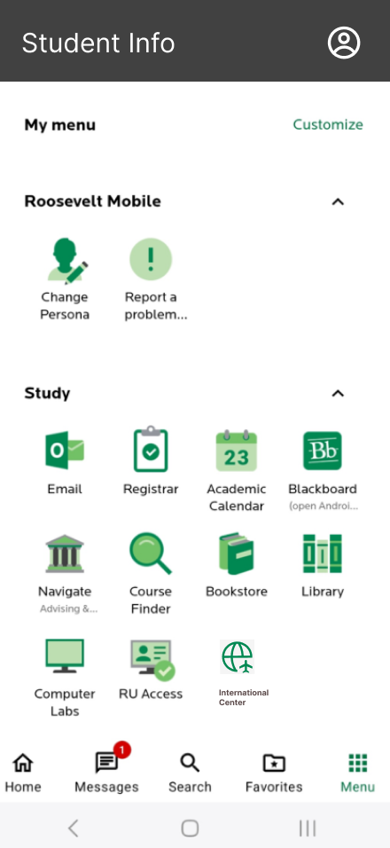
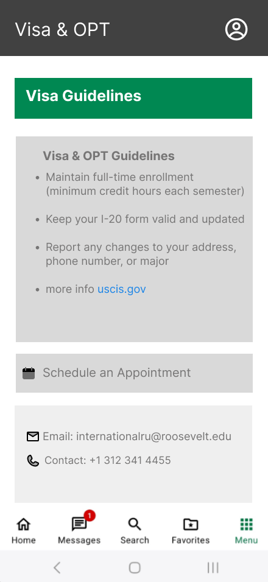
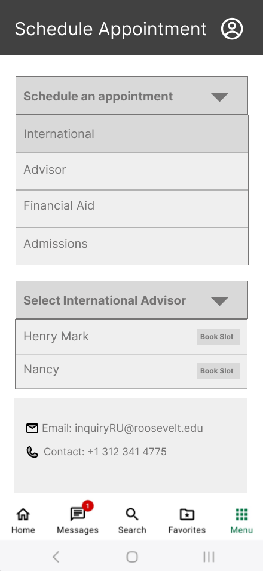
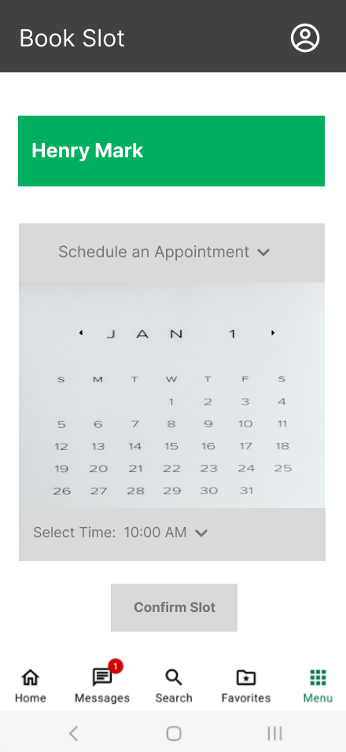

#  Roosevelt University Mobile App – Re-Designed Prototype

This project is a UI/UX redesign of the Roosevelt University Mobile App, The redesign focuses on improving usability, accessibility, and support for international students using Figma.

---

## Project Goals

- Simplify and improve the **home screen layout**
- Add missing features like **Student ID access** and **Advisor Appointment Booking**
- Introduce a dedicated **International Center module**
- Enhance the overall user experience for **international students**

---

##  Features Added

- **Digital Student ID** with QR code
- **Visa & OPT Guidelines** for international students
- **Advisor Appointment Booking System**
- **Housing Help Section**
- **Navigation** and layout improvements

---

## Prototype Demo (YouTube)

🔗 [Watch on YouTube](https://www.youtube.com/watch?v=4WasXYRV7SA)

---

## View the Figma Design

🔗 [Click here to open the Figma Prototype](https://www.figma.com/proto/N5hEiaT1DGWted7vU1Y6rd/TalentXchange-Mobile-App?page-id=78%3A79&node-id=81-86&p=f&viewport=404%2C322%2C0.21&t=Udn8nYfxF4lYLRX5-1&scaling=scale-down&content-scaling=fixed&starting-point-node-id=81%3A86)

---

##  Screenshots

###  Home & Student ID

###  Menu & International Center

###  Visa Guidelines & Appointments

---
akundur17@gmail.com
